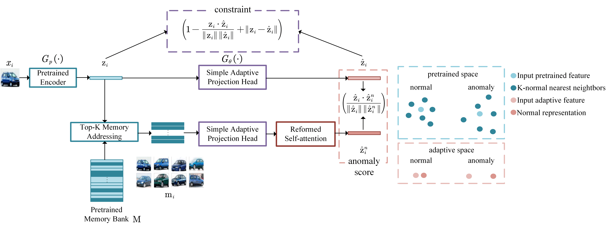

# CAP

implementation of paper "Constrained Adaptive Projection with Pretrained Features for Anomaly Detection“ （CAP）

paper address: https://arxiv.org/abs/2112.02597 (not final version)

## 1. Requirements
Currently, requires following packages
- python 3.9.5
- torch 1.9.0
- CUDA 11.1
- torchvision 0.10
- faiss 1.7.1
- scikit-learn 0.24.2

## 2. Framework
<div align="center">    
      
</div>


## 3. Experiment
### quickly run

> For cifar10
```
sh cifar10.sh
```
> For cifar100, exchange --dataset cifar100

> For mvTec, please download mvTec dataset and exchange hyperparameters corresponding to appendix file.


### run a specific class

```
python main.py --dataset <dataset> --normal_class <normal-class> --regular <constrained lambda>
```


